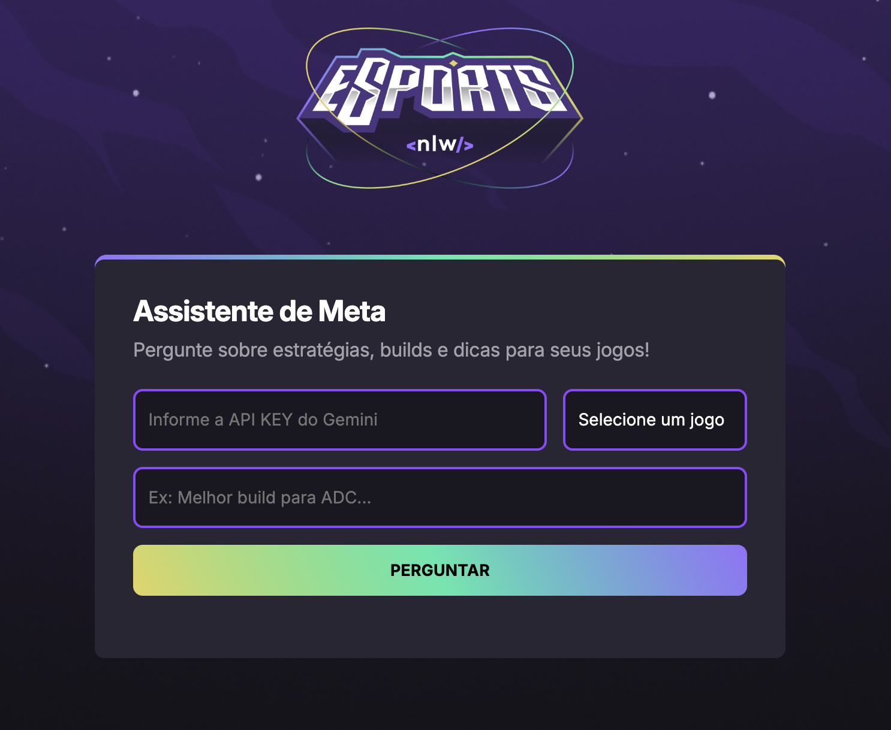

# Assistente de Meta NLW#20

## 🖼️ Preview



Este projeto é um assistente inteligente para gamers, que responde perguntas sobre estratégias, builds e dicas dos principais jogos competitivos, utilizando a API Gemini da Google.

## 🚀 Funcionalidades

- Escolha entre os jogos: Valorant, League of Legends, Elden Ring e CS:GO2.
- Receba respostas rápidas e objetivas sobre estratégias, builds e dicas.
- Interface moderna, responsiva e fácil de usar.
- Integração com IA (Gemini) para respostas atualizadas.
- Conversão automática de respostas em Markdown para HTML.

## 🛠️ Tecnologias

- **HTML5**
- **CSS3**
- **JavaScript**
- [Showdown.js](https://github.com/showdownjs/showdown) (Markdown para HTML)
- [Google Gemini API](https://ai.google.dev/)

## ⚙️ Como usar

1. Clone o repositório:
   ```bash
   git clone https://github.com/seu-usuario/NLW20-Assistente-Meta.git
   ```
2. Instale as dependências (se necessário).
3. Obtenha uma API KEY do [Google Gemini](https://ai.google.dev/).
4. Abra o arquivo `index.html` em seu navegador.
5. Informe sua API KEY, selecione o jogo e faça sua pergunta!

## 💡 Observações

- As respostas são geradas pela IA Gemini, baseadas no patch atual do jogo.
- O projeto não armazena sua API KEY.
- Para melhor experiência, utilize navegadores atualizados.

---

Feito com 💜 por [Luiz](https://github.com/Luiz-tkd54)
